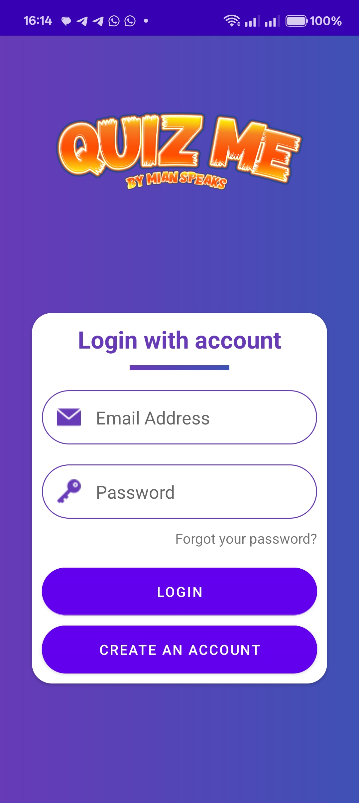

# Quiz Application

## 📌 Description
**Quiz Application** is an engaging Android app where users can play quizzes from various categories and earn points.  
It provides a fun and interactive way to test your knowledge, track your scores, and compete with others on the leaderboard.  
You can register, log in, play quizzes, share your results, and manage your profile — all in one place!

---

## ✨ Features

### 1. Splash Screen
Displays the application name and developer credit — **"Made By ❤️ Ashish"**.  

### 2. Login Screen
Registered users can log in to access their accounts.  

### 3. Register Screen
New users can sign up by providing basic details.  

### 4. Main Activity
Shows available quiz categories for the user to choose from.  

### 5. Quiz Activity
Displays questions with **4 answer options** each.  
- **Next** button → Moves to the next question (until the last one).  
- **Quit** button → Ends the quiz and shows results.  
- Shows whether the answer was correct or wrong.  

Correct Answer Example:  
  

Wrong Answer Example:  

### 6. Result Activity
Shows the final score with two options:  
- **Restart** — Play again.  
- **Share** — Share your result screenshot via Android's share options.  

### 7. Share Feature
Automatically takes a screenshot of your result and opens the Android share dialog.  

### 8. Rank (Leaderboard)
Displays names and scores of all players sorted from **highest to lowest**.  

### 9. Wallet
Shows your quiz points with a **PayPal withdrawal UI** (withdrawal not implemented).  

### 10. Profile
Update your profile details or log out from your account.  

---

## 📥 Installation
Download the APK from the link below and install it on your Android phone:  
[📎 Download APK](https://drive.google.com/file/d/1STMXM4BTywkSX66eOc-O2wU0rW12qR-m/view?usp=sharing)  

---

## 🛠 Tech Stack
- **IDE:** Android Studio  
- **Languages:** Java, XML  
- **Database & Backend:** Firebase  
- **Graphics:** Vector Drawables  

---

## 📱 Requirements
- **Minimum Android Version:** 9 (Pie)

---

## 👨‍💻 Author
**Ashish Kumar Panda**  
[GitHub Profile](https://github.com/ashish0panda)

---

## 📄 License
**All Rights Reserved** — You may not use, copy, modify, or distribute this app without explicit permission from the author.
